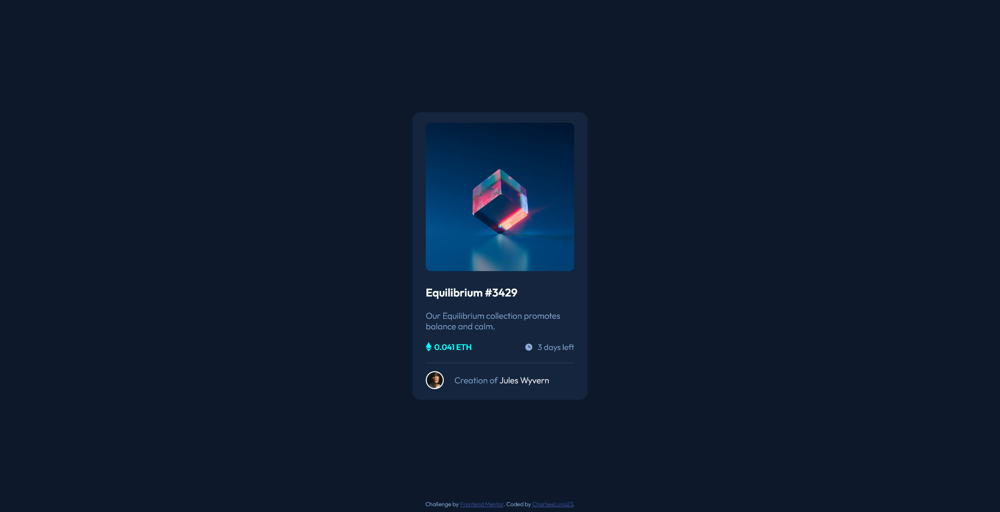

# Frontend Mentor - NFT preview card component solution

This is a solution to the [NFT preview card component challenge on Frontend Mentor](https://www.frontendmentor.io/challenges/nft-preview-card-component-SbdUL_w0U). Frontend Mentor challenges help you improve your coding skills by building realistic projects. 

## Table of contents

- [Overview](#overview)
  - [The challenge](#the-challenge)
  - [Screenshot](#screenshot)
  - [Links](#links)
- [My process](#my-process)
  - [Built with](#built-with)
  - [What I learned](#what-i-learned)
  - [Continued development](#continued-development)
  - [Useful resources](#useful-resources)
- [Author](#author)

## Overview

### The challenge

Users should be able to:

- View the optimal layout depending on their device's screen size
- See hover states for interactive elements

### Screenshot

### Links

- Solution URL: [Add solution URL here](https://your-solution-url.com)
- Live Site URL: [Add live site URL here](https://your-live-site-url.com)

## My process

### Built with

- Semantic HTML5 markup
- CSS custom properties
- Flexbox
- CSS Grid
- Mobile-first workflow

### What I learned

I practiced the information I already knew but I was able to easily center the card on the website, something I wasn't able to do in a previous challenge.

I was able to learn how to overlap images to create a "view image" type effect.

### Continued development

To easily identify the correct CSS style that I need and the correct arrangement for HTML.

### Useful resources

- [Example resource 1](https://developer.mozilla.org/es/docs/Web/CSS/align-items) - This helped me to get a better understanding of 'align-items'.

- [Example resource 2](https://www.youtube.com/watch?v=88aBN3N45WA&ab_channel=CodeAgam) - This helped me create the hover effect for the image and only that, I swear :).

## Author

- FreeCodeCamp - [Add your name here](https://www.freecodecamp.org/CharlieeLuna)
- Frontend Mentor - [@CharlieeLuna23](https://www.frontendmentor.io/profile/CharlieeLuna23)
